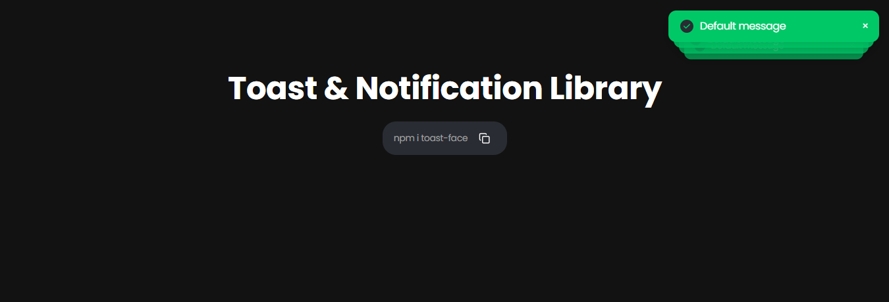

# 🥐 Toastface

**Toastface** is a modern, customizable, and minimal toast notification library for React with built-in support for custom icons, animations, loaders, notifications, dark mode, and more.



---

## 🚀 Features

- 🔥 Light and Dark modes
- ✅ Success, Error, Warning, Default, Custom, and Notification styles
- ⏳ Built-in loader animation with customizable duration
- 🎨 Pass your own icons or use built-in SVGs
- 🎬 Popup, slide, squeezy animations
- 🔁 Queue, block, and stack display styles
- 💡 Easily theme and style every toast
- 🧠 Dev playground to preview and generate toast code

---

## 📦 Installation

```bash
npm install toastface
# or
yarn add toastface


